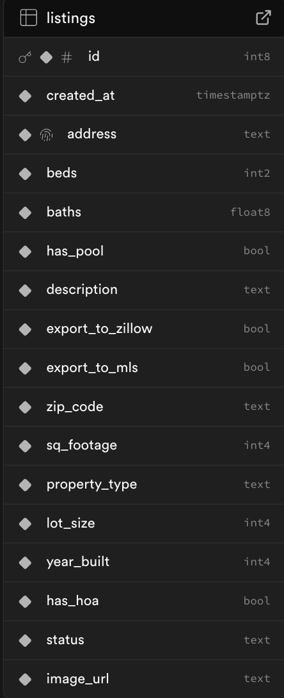
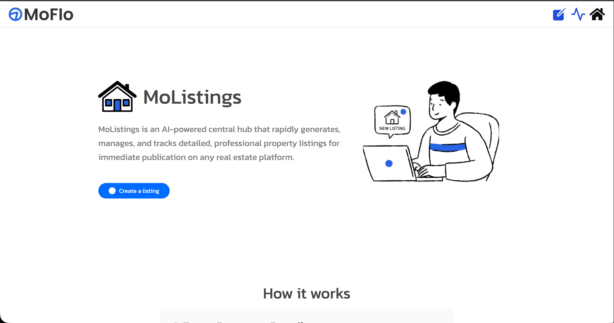
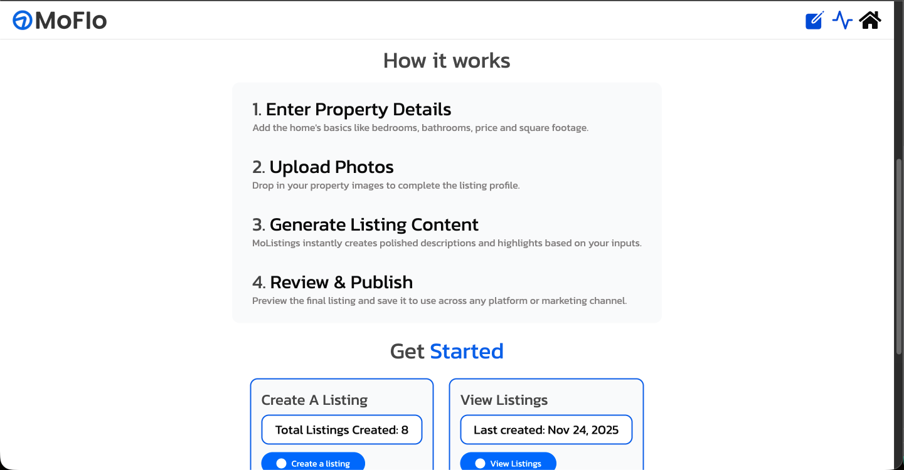
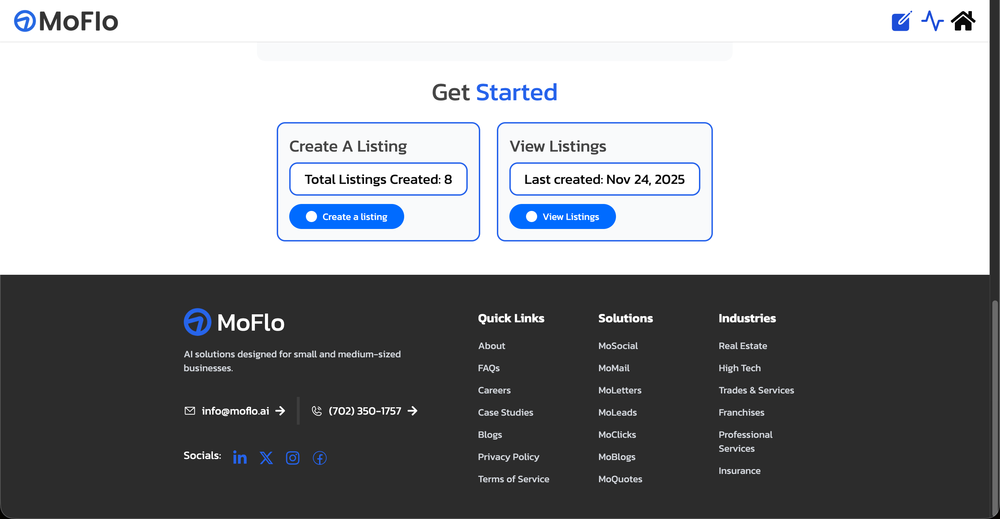
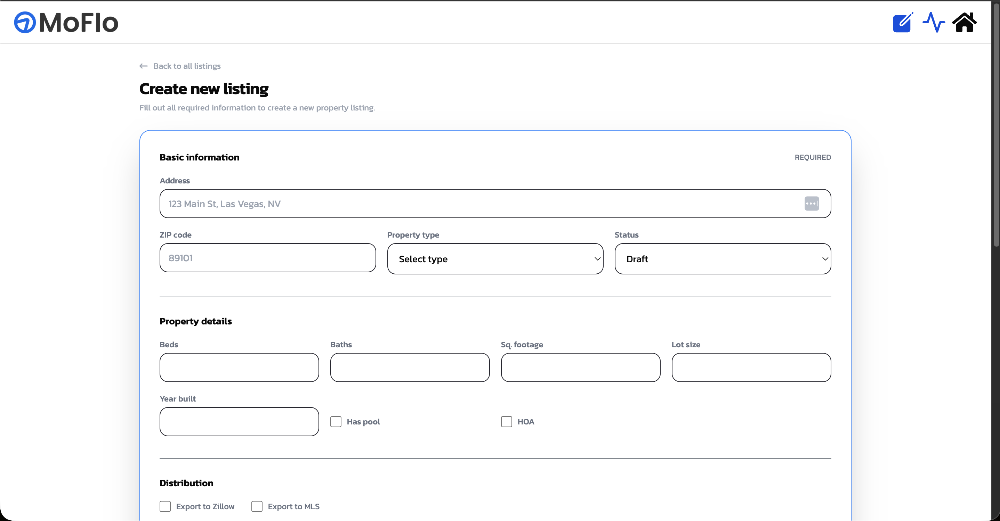
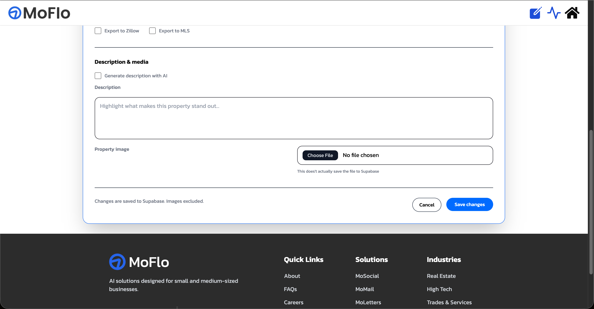
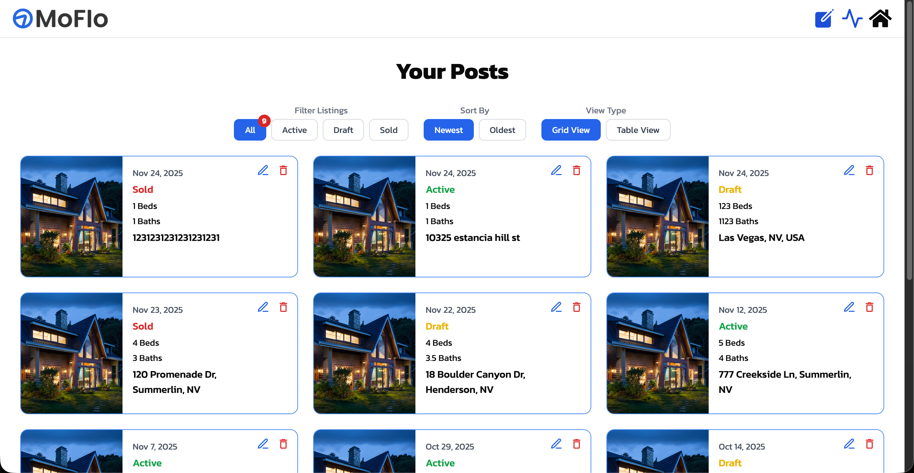
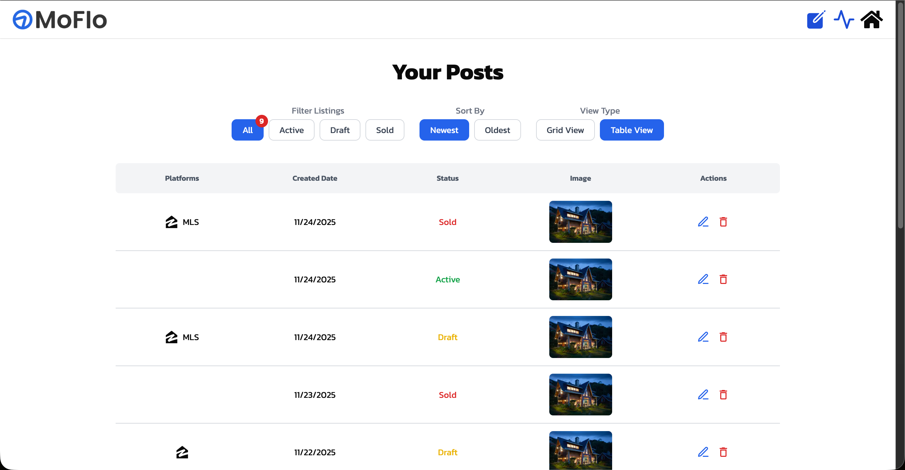
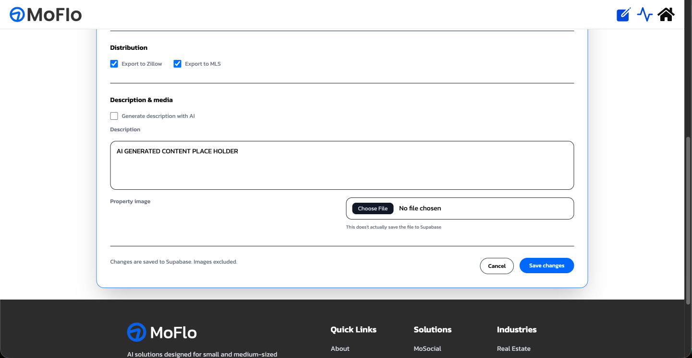

# MoListings — MoFlo Take-Home Project

MoListings is a real estate focused integration built for the MoFlo Cloud
It allows agents and property managers to generate, manage, and organize real estate listings that can be exported to major platforms such as Zillow and MLS

This project was built using **Next.js 15**, **TypeScript**, **Supabase**, and **TailwindCSS**, following MoFlo’s design patterns

---

## Note my answers are in the answers.txt file root of the repo

## Features

### **Landing Page (/)**

- Hero section introducing _MoListings_
- “How It Works” guide (property details → photos → content → publish)
- Real-time stats:
  - Total listings created
  - Last created date
- Navigation buttons to:
  - Create new listing
  - View existing listings
  - Back home
- Fully responsive across mobile and desktop

---

## Create Listing (/view-listings/create)

A step-by-step form for generating structured listing data.

The JSON output will be submitted in the `public/output` folder

### **Form Sections**

- **Basic Information**  
  Address, ZIP code, property type, status
- **Property Details**  
  Beds, baths, square footage, lot size, year built, pool, HOA
- **Distribution**
  Export to Zillow and/or MLS
- **Description & Media**
  Manual description or placeholder AI description  
  Image upload (mocked no real storage)

### **Key Behaviors**

- Full server side validation for address, ZIP, enums, numeric ranges, description length
- Errors shown for form field
- Submission saves listing data to Supabase
- Redirects to `/view-listings`

---

## View & Manage Listings (/view-listings)

### **View Modes**

- **Grid View**  
  Card-based layout with listing image, status, beds/baths, address, and date the post was created.
- **Table View**  
  Spreadsheet-style layout with:
  - Platforms (Zillow / MLS icons)
  - Created Date
  - Status
  - Image
  - Edit/Delete actions

### **Filtering & Sorting**

- **Filter:** All, Active, Draft, Sold
- **Sort:** Newest, Oldest

### **Listing Actions**

- Edit (loads data into edit form)
- Delete (removes record from Supabase + UI)

---

## Tech Stack

- **Next.js 15 (App Router)**
- **TypeScript**
- **Supabase (Database + API)**
- **TailwindCSS** (using MoFlo-style design)
- **React Hooks + Context**
- **Server Actions** for form processing, validation, and DB writes

---

## File Structure Overview

<!--
/app
├── (landing)
│ ├── GetStarted.tsx
│ ├── Hero.tsx
│ ├── HowItWorks.tsx
|
├── view-listings
│ ├── page.tsx (Listings dashboard)
| ├── actions.ts (Server actions)
| ├── utils.ts
│ └── components
│   ├── FilterBar.tsx
│   ├── GridCard.tsx
│   └── Table.tsx
│
| └── create
│   └── page.tsx (Create listing form)
|
| └── edit
│ └── [listingId]
│   └── page.tsx (Edit listing form)
│ └── components
│   ├── DescriptionInput.tsx
│   ├── EditForm.tsx
│   ├── FileInput.tsx
│   └── SubmitWithLoading.tsx
│ ├── actions.ts
│ ├── page.tsx (Landing page)
│ └── utils.ts
│
├── page.tsx (Landing page)
├── not-found.tsx
├── layout.tsx

/components
├── Navbar.tsx
├── Footer.tsx
└── ArrowButton.tsx

/lib
└── supabase
| ├── client.ts
| └── server.ts

/public
├── img
│  └── house.png
│  └── moflo-logo.png
│  └── moflo.png
│  └── new-listing-image.png
├── output
└── readme_img
-->

## Running the Project Locally

### **1. Install dependencies**

Clone this repo

### **2. Install dependencies**

`npm install`

### **3. Add Environment Variables**

Create a .env.local file in the root of the project and add:

`NEXT_PUBLIC_SUPABASE_URL=KEY`
`NEXT_PUBLIC_SUPABASE_ANON_KEY=KEY`

### **4. Run development server**
`npm run build` and `npm run start`

The app will be available at: http://localhost:3000

## Database schema

## Screenshots

### **Landing Page**

### **Create Page**

### **View Page**

### **View Page**

Diary through out building this...

Fri Nov 21st 2025 10:25 PM

Read some articles about SupaBase and I just finished thinking of what my MoApp would be... I was thinking of MoListings

an app for real estate agents to quickly generate property listings descriptions, captions, and formatted data for platforms like Zillow, Redfin, MLS, and Instagram based on simple inputs like bedrooms, bathrooms, square footage, and uploaded house photos.

(I don't know if instagram applies to this since there already is a MoSocials... Also idk I don't really see houses on my feed but then again it's riddled with Brain Rot... I will research on this more later...)

I did some house searching and I found out that the inputs agents need to fill out are

Just practiced retrieving the listings from supabase... and I realized I needed photos as well and now I don't know how to do that

Sat Nov 22nd 2025 3:16 PM

Forgot to journal this part but I finished setting up Supabase kinda nervous also I created the front end first since for me it's hard to start on the back end if I can't see it? Idk how to explain it but I used figma to design the landing page first so it's easier to edit yada yada yada... I also copied the style from MoLetters for the UI design and then I found a MoFlo Youtube video so I will copy that for the `/create` page... I'm most nervous for the `/create`

Sun Nov 23 2:43 AM Im working on the viewing stage... so like editing viewing the post seeing the information about the post... created Date... if it's posted or draft or what not... platforms as well... But I couldn't find the platform icons except for Zillow... Redfin or MLS don't have an Icon

Going to take a nap but for the Filter by I decided to do All Active Draft and Sold then for Sort By I'll just do Newest and oldest and then View by I'll do Grid and table... I am stalling so hard for the create page I am so SCARED but the more I actually work on this project I realize that it'll be easier I kinda am happy that I am start Frontend first then Backend then Frontend then Backend then Frontend again... it actually makes it so easy for me at least... I like how I can see where my code is going it helps me understand it more... Anyways let's see if I can sleep it's 3:13 AM

Nov 24th 1:49 AM Supabase just suddenly stopped working... dude literally nothing changed... Just started panicking -\_- edit: It came back up

Nov 24th 7:06 PM I forgot / didn't feel like journalizing this no more I used the comments for that I needed to focus since it's due today
